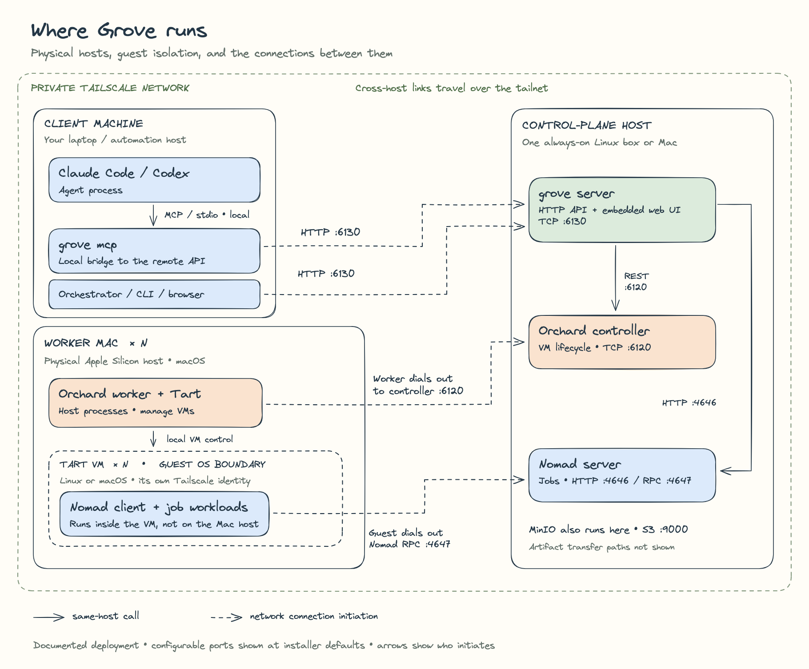

# grove

grove turns the Apple Silicon Macs (and a Linux box) you already own into a private cloud for CI
builds, deploys, and coding-agent sessions — VM-isolated, packed tightly with a real job
scheduler, and reachable only over your Tailscale tailnet.

## Why

Mac CI is expensive, and the tooling around it is thin. GitHub Actions bills macOS minutes at roughly 10x the Linux
rate, there is no macOS container runtime (every "Mac as a k8s node" story is a third-party
virtual-kubelet), and Apple's Virtualization.framework allows only two VMs per Mac — so the
usual one-VM-per-job setup caps each machine at two concurrent jobs.

grove runs jobs on Macs you already own, with no per-minute bill. Each Mac runs **Tart** VMs,
and each VM runs a **Nomad** client that packs many jobs inside it: the VM is the isolation
boundary, Nomad is the scheduler within it. Every job — CI or agent — runs inside a VM, not
next to your other work on the bare host.

## Fleet at a glance


## Quick start

```bash
# on each Mac you want in the fleet (installs via Homebrew — this repo is its own tap)
curl -fsSL https://raw.githubusercontent.com/gm2211/grove/main/scripts/install.sh | sh

# already installed? upgrade in place any time:
brew upgrade grove

# on the always-on box (Linux, or a dedicated Mac)
grove install --role control-plane

# on every Mac that should run jobs
grove install --role worker --controller https://grove-cp.<tailnet>.ts.net:6120 --token <bootstrap-token>

# from anywhere on the tailnet: create the worker VMs from fleet.yaml
grove fleet apply

# run a one-off shell command on the macos pool, streaming logs live
grove dispatch --pool macos --kind shell --follow -- 'echo hi'

# run a build on the linux pool against a real repo/ref
grove dispatch --pool linux --kind build --repo https://github.com/you/app --ref main -- 'make test'

# watch, list, and check on jobs after the fact
grove logs <id> --follow
grove jobs ls
grove fleet status

# is everything healthy?
grove doctor
```

Full walkthrough (roles, flags, failure modes like the macOS 15+ Local Network permission popup):
[docs/INSTALL.md](docs/INSTALL.md).

## Use from Claude Code / Codex

```bash
claude mcp add grove -- grove mcp
```

`grove mcp` exposes the fleet over MCP (stdio) — `grove_fleet`, `grove_run`, `grove_job_status`,
`grove_job_logs`, `grove_job_cancel`, `grove_recycle_vm`, `grove_pause_worker` — so an agent can
dispatch and follow its own jobs without shelling out to the CLI. Example prompt:

> Run this repo's test suite on the `linux` pool and tell me if it passes.

See [docs/MCP.md](docs/MCP.md) for Codex / Claude Desktop registration and the full tool list.

## Use from an agent orchestrator

An orchestrator's `grove` executor drives grove over the same HTTP API as everything else: `POST
/jobs` to submit a work unit, `GET /jobs/{id}` to poll, NDJSON log streaming with offset-based
resume, and an `idempotencyKey` convention (`<orchestrator>:<taskId>:<runId>`) that makes retries
safe. See [docs/ORCHESTRATOR.md](docs/ORCHESTRATOR.md) for the full work unit → JobRequest mapping
and status vocabulary.

## How it works



[Editable Excalidraw source](docs/diagrams/architecture.excalidraw) ·
[SVG](docs/diagrams/architecture.svg)

Solid outlines identify physical host roles; the nested dashed VM outline marks guest OS
isolation. The outer green outline is the private Tailscale network. A control-plane role
can run on Linux or a Mac; the diagram separates roles for clarity.

Solid arrows are same-host calls. Dashed arrows show network connection initiation:
clients reach Grove's API, Orchard workers reach the controller, and Nomad clients inside
VMs reach the Nomad server. `grove mcp` speaks stdio locally to its agent and HTTP to the
remote Grove API. Ports show installer defaults, not a live deployment audit. MinIO is
co-located on the control-plane host; artifact transfer paths are omitted.

See [docs/FLOW.md](docs/FLOW.md) for the full layering diagram plus a sequence diagram for one
job end to end and the VM recycling loop.

Three separate systems, deliberate seams:

| Layer | Owns | Never knows about |
|---|---|---|
| **Orchard** (our fork) | VM lifecycle: create, place, restart, TTL, delete | jobs, Nomad |
| **Nomad** | job scheduling *inside* VMs: placement, packing, queueing, retries, logs | VMs, Tart, Orchard |
| **grove** | desired fleet state, job submission API, UI, install | — it's the only layer that sees both |

Full design, fleet spec, job model, and HTTP API reference: [ARCHITECTURE.md](ARCHITECTURE.md).

## What works today

- fleet reconciler that keeps Orchard VMs matching `fleet.yaml`, including per-VM TTL and
  shutdown hooks, plus a background reconcile loop in `grove serve`
  (`--fleet-reconcile-interval`, `--no-fleet-reconcile`)
- parameterized Nomad jobs for `build` / `agent` / `shell`, dispatched and tracked end to end,
  with resumable NDJSON log streaming and stuck/orphaned-job detection (`lost` status)
- HTTP API (`/api/v1/...`) + embedded control-plane UI (fleet view, job list, job detail with
  live logs, dispatch form, settings)
- MCP server for orchestrators (Claude Code, Codex, your own agent runner) to dispatch and follow
  jobs over stdio
- `grove install` role bootstrap (`worker` / `control-plane` / `client`) and `grove doctor`
  health checks
- agent-orchestrator executor contract — see [docs/ORCHESTRATOR.md](docs/ORCHESTRATOR.md)

## Not yet

- only live-tested on a single-host smoke stack, not a multi-Mac fleet
- worker images (`ghcr.io/gm2211/grove-linux-worker`, `ghcr.io/gm2211/grove-macos-worker`, tags
  `latest` + date) are published but private by default — make the GitHub packages public or pass
  `grove install --role worker --registry-token …` (see [docs/IMAGES.md](docs/IMAGES.md))
- per-dispatch CPU/memory sizing (`JobRequest.Resources`) is validated but not yet applied to the
  running job — see [docs/JOBS.md](docs/JOBS.md) "Per-job resource sizing"

See [CHANGELOG.md](CHANGELOG.md) for what shipped in each release.

## Requirements

| | |
|---|---|
| **Hardware** | Apple Silicon Mac for any `worker`; macOS or Linux for `control-plane`; anything for `client` |
| **OS** | macOS 15+ (for the Local Network permission worker Macs need) |
| **Tailscale** | standalone variant, already authenticated — **not** the Mac App Store build (it doesn't start before login) |
| **Homebrew** | grove is its own tap; on recent Homebrew you may need `brew trust openai/tools` before Tart will install |
| **Registry access** | grove's worker images on `ghcr.io` are private by default — make the GitHub packages public, or `grove install --role worker --registry-token …` (see [docs/INSTALL.md](docs/INSTALL.md)) |

grove installs everything else itself (Tart, Nomad, MinIO, Orchard).

## Docs

| Doc | Covers |
|---|---|
| [ARCHITECTURE.md](ARCHITECTURE.md) | Full design: layering, fleet spec, job model, HTTP API |
| [docs/FLOW.md](docs/FLOW.md) | Mermaid diagrams: layering, one job end to end, the recycling loop |
| [docs/INSTALL.md](docs/INSTALL.md) | Role-by-role install walkthrough and failure modes |
| [docs/OPERATIONS.md](docs/OPERATIONS.md) | Day-2 ops: recycling, image rollouts, pausing a Mac, logs, upgrading |
| [docs/JOBS.md](docs/JOBS.md) | The `JobRequest` ↔ Nomad job contract |
| [docs/MCP.md](docs/MCP.md) | The MCP server: tools, resources, client registration |
| [docs/ORCHESTRATOR.md](docs/ORCHESTRATOR.md) | The agent-orchestrator executor contract |
| [docs/IMAGES.md](docs/IMAGES.md) | Building and pushing the Tart/container images |
| [CHANGELOG.md](CHANGELOG.md) | Release notes |

## License

MIT
