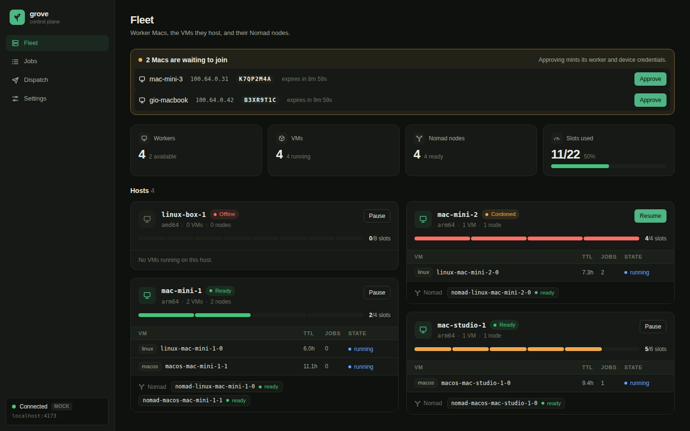
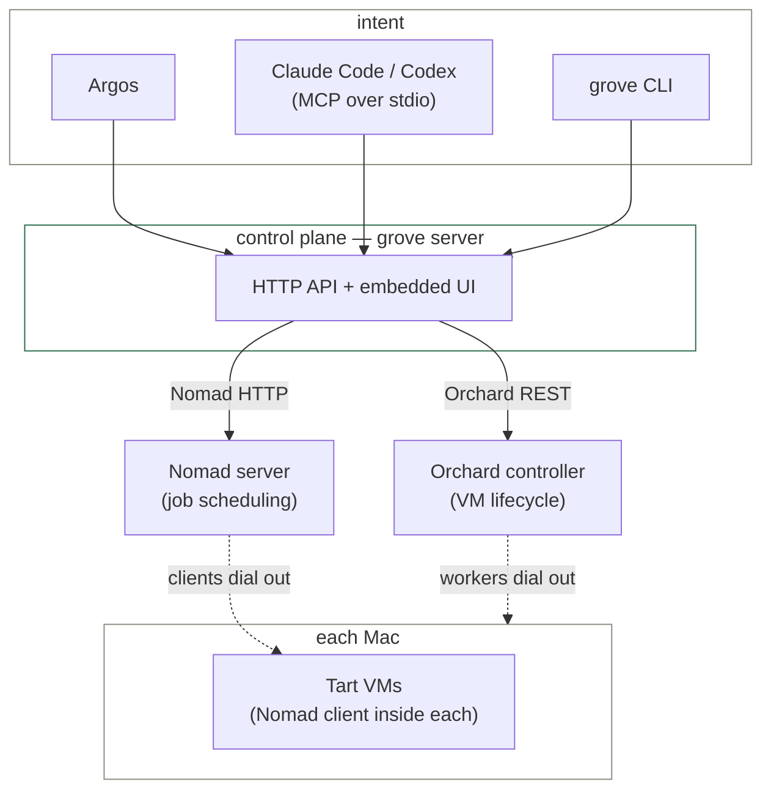

# grove

grove turns the Apple Silicon Macs (and a Linux box) you already own into a private cloud for CI
builds, deploys, and coding-agent sessions — VM-isolated, packed tightly with a real job
scheduler, and reachable only over your Tailscale tailnet.

## Why

| | |
|---|---|
| **GitHub Actions macOS minutes cost ~10x Linux minutes** | grove runs on hardware you already own — no per-minute bill. |
| **There's no macOS container runtime** | every "Mac as a k8s node" story is a third-party virtual-kubelet; grove uses **Tart** VMs instead, with **Nomad** packing jobs inside them. |
| **One VM per job caps macOS at 2 concurrent jobs/Mac** | Apple's Virtualization.framework limit. grove's VMs run a **Nomad client**, so many jobs get packed into each VM — the VM is the isolation boundary, Nomad is the scheduler inside it. |
| **Agents and CI need real isolation, not just a sandboxed process** | every job runs inside a VM, not next to your other jobs on the bare host. |

## Fleet at a glance



## Quick start

```bash
# on each Mac you want in the fleet (installs via Homebrew — this repo is its own tap)
curl -fsSL https://raw.githubusercontent.com/gm2211/grove/main/scripts/install.sh | sh

# already installed? upgrade in place any time:
brew upgrade grove

# on the always-on box (Linux, or a dedicated Mac)
grove install --role control-plane

# on every Mac that should run jobs
grove install --role worker --controller https://grove-cp.<tailnet>.ts.net:6120 --token <bootstrap-token>

# from anywhere on the tailnet: create the worker VMs from fleet.yaml
grove fleet apply

# run a one-off shell command on the macos pool, streaming logs live
grove dispatch --pool macos --kind shell --follow -- 'echo hi'

# run a build on the linux pool against a real repo/ref
grove dispatch --pool linux --kind build --repo https://github.com/you/app --ref main -- 'make test'

# watch, list, and check on jobs after the fact
grove logs <id> --follow
grove jobs ls
grove fleet status

# is everything healthy?
grove doctor
```

Full walkthrough (roles, flags, failure modes like the macOS 15+ Local Network permission popup):
[docs/INSTALL.md](docs/INSTALL.md).

## Use from Claude Code / Codex

```bash
claude mcp add grove -- grove mcp
```

`grove mcp` exposes the fleet over MCP (stdio) — `grove_fleet`, `grove_run`, `grove_job_status`,
`grove_job_logs`, `grove_job_cancel`, `grove_recycle_vm`, `grove_pause_worker` — so an agent can
dispatch and follow its own jobs without shelling out to the CLI. Example prompt:

> Run this repo's test suite on the `linux` pool and tell me if it passes.

See [docs/MCP.md](docs/MCP.md) for Codex / Claude Desktop registration and the full tool list.

## Use from Argos

Argos's `grove` executor drives grove over the same HTTP API as everything else: `POST /jobs` to
submit a WorkUnit, `GET /jobs/{id}` to poll, NDJSON log streaming with offset-based resume, and an
`idempotencyKey` convention (`argos:<taskId>:<runId>`) that makes retries safe. See
[docs/ARGOS.md](docs/ARGOS.md) for the full WorkUnit → JobRequest mapping and status vocabulary.

## How it works



See [docs/FLOW.md](docs/FLOW.md) for the full layering diagram plus a sequence diagram for one
job end to end and the VM recycling loop.

Three separate systems, deliberate seams:

| Layer | Owns | Never knows about |
|---|---|---|
| **Orchard** (our fork) | VM lifecycle: create, place, restart, TTL, delete | jobs, Nomad |
| **Nomad** | job scheduling *inside* VMs: placement, packing, queueing, retries, logs | VMs, Tart, Orchard |
| **grove** | desired fleet state, job submission API, UI, install | — it's the only layer that sees both |

Full design, fleet spec, job model, and HTTP API reference: [ARCHITECTURE.md](ARCHITECTURE.md).

## What works today

- fleet reconciler that keeps Orchard VMs matching `fleet.yaml`, including per-VM TTL and
  shutdown hooks, plus a background reconcile loop in `grove serve`
  (`--fleet-reconcile-interval`, `--no-fleet-reconcile`)
- parameterized Nomad jobs for `build` / `agent` / `shell`, dispatched and tracked end to end,
  with resumable NDJSON log streaming and stuck/orphaned-job detection (`lost` status)
- HTTP API (`/api/v1/...`) + embedded control-plane UI (fleet view, job list, job detail with
  live logs, dispatch form, settings)
- MCP server for orchestrators (Claude Code, Codex, Argos) to dispatch and follow jobs over stdio
- `grove install` role bootstrap (`worker` / `control-plane` / `client`) and `grove doctor`
  health checks
- Argos integration — see [docs/ARGOS.md](docs/ARGOS.md)

## Not yet

- only live-tested on a single-host smoke stack, not a multi-Mac fleet
- Tart VM images aren't published to `ghcr.io` yet — you build your own from `images/`
  (see [docs/IMAGES.md](docs/IMAGES.md))
- per-dispatch CPU/memory sizing (`JobRequest.Resources`) is validated but not yet applied to the
  running job — see [docs/JOBS.md](docs/JOBS.md) "Per-job resource sizing"

See [CHANGELOG.md](CHANGELOG.md) for what shipped in each release.

## Requirements

| | |
|---|---|
| **Hardware** | Apple Silicon Mac for any `worker`; macOS or Linux for `control-plane`; anything for `client` |
| **OS** | macOS 15+ (for the Local Network permission worker Macs need) |
| **Tailscale** | standalone variant, already authenticated — **not** the Mac App Store build (it doesn't start before login) |
| **Homebrew** | grove is its own tap; on recent Homebrew you may need `brew trust openai/tools` before Tart will install |
| **Registry access** | grove's worker images on `ghcr.io` are private by default — make the GitHub packages public, or `grove install --role worker --registry-token …` (see [docs/INSTALL.md](docs/INSTALL.md)) |

grove installs everything else itself (Tart, Nomad, MinIO, Orchard).

## Docs

| Doc | Covers |
|---|---|
| [ARCHITECTURE.md](ARCHITECTURE.md) | Full design: layering, fleet spec, job model, HTTP API |
| [docs/FLOW.md](docs/FLOW.md) | Mermaid diagrams: layering, one job end to end, the recycling loop |
| [docs/INSTALL.md](docs/INSTALL.md) | Role-by-role install walkthrough and failure modes |
| [docs/OPERATIONS.md](docs/OPERATIONS.md) | Day-2 ops: recycling, image rollouts, pausing a Mac, logs, upgrading |
| [docs/JOBS.md](docs/JOBS.md) | The `JobRequest` ↔ Nomad job contract |
| [docs/MCP.md](docs/MCP.md) | The MCP server: tools, resources, client registration |
| [docs/ARGOS.md](docs/ARGOS.md) | The Argos executor contract |
| [docs/IMAGES.md](docs/IMAGES.md) | Building and pushing the Tart/container images |
| [CHANGELOG.md](CHANGELOG.md) | Release notes |

## License

MIT
