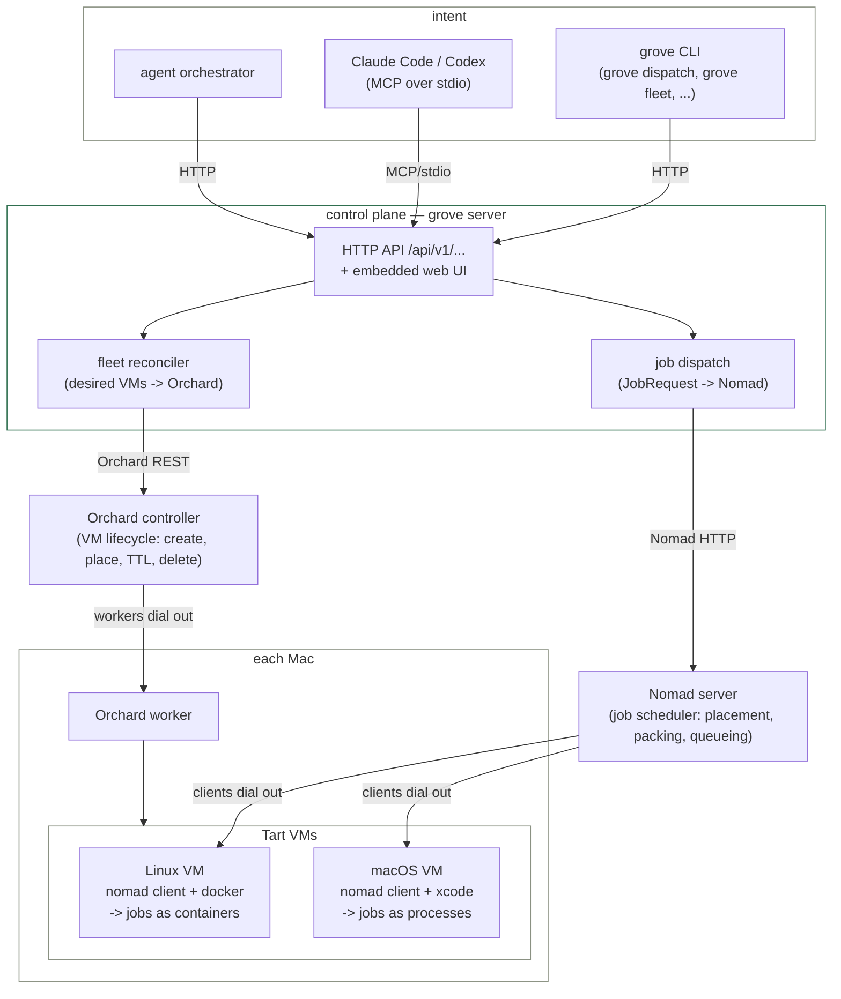
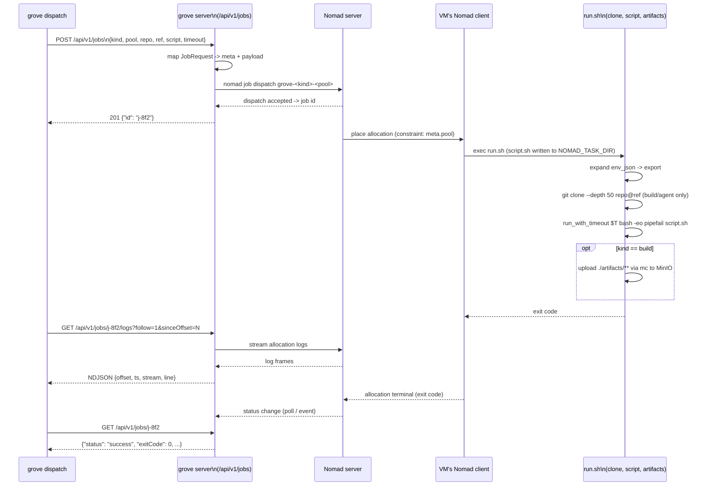
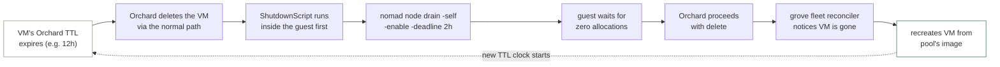

# grove — flow diagrams

Three views of the same system, each answering a different question. See
[ARCHITECTURE.md](../ARCHITECTURE.md) for the prose version of the layering and the fleet/job
contracts these diagrams summarize.

## 1. Layering — who talks to what

Intent flows down through one control plane into two independent systems (VM lifecycle, job
scheduling), which meet only inside each Mac.

Three separate responsibilities, three separate systems (see ARCHITECTURE.md's "The layering"
table for what each layer owns and never knows about): **Orchard** owns VM lifecycle, **Nomad**
owns job scheduling inside VMs, **grove** is the only layer that sees both.

## 2. One job, start to finish

`grove dispatch` (or the MCP `grove_run` tool, or an orchestrator's executor) to a finished job
with logs
and an exit code:

Kinds differ only in what `run.sh` does after the clone (see docs/JOBS.md): `build` uploads
artifacts, `agent` stays long-running with a 10m `kill_timeout`, `shell` skips the clone entirely.

## 3. Recycling loop — nothing is cleaned, only replaced

The guest drains itself — Orchard never learns Nomad exists, and Nomad never learns about VM
lifecycle (ARCHITECTURE.md's "Recycling / hygiene"). Tailscale inside guests uses ephemeral tagged
auth keys, so a recycled VM also vanishes and reappears on the tailnet under a fresh identity.

Same mechanism drives a forced recycle (`POST /api/v1/vms/{name}/recycle`, or the MCP
`grove_recycle_vm` tool) — it's the TTL-expiry path run on demand instead of waiting for the
clock, then the reconciler takes over exactly as above.
